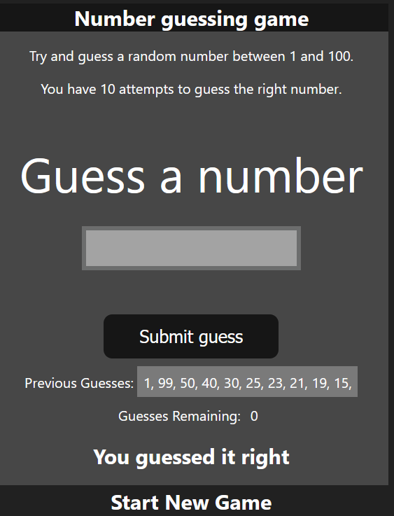

# projects related to DOM

## project link

[click here](https://stackblitz.com/edit/stackblitz-starters-udgqpy?file=index.html)

# solution code

## project 1

```javascript
let randomNumber = parseInt(Math.random() * 100 + 1);

const submit = document.querySelector("#subt");
const userInput = document.querySelector("#guessField");
const guessSlot = document.querySelector(".guesses");
const remaining = document.querySelector(".lastResult");
const lowOrHi = document.querySelector(".lowOrHi");
const startOver = document.querySelector(".resultParas");

const p = document.createElement("p");

let prevGuess = [];
let numGuess = 1; //how many attempt

let playGame = true;

if (playGame) {
  submit.addEventListener("click", function (e) {
    e.preventDefault();
    const guess = parseInt(userInput.value);
    console.log(guess);
    validateGuess(guess);
  });
}

function validateGuess(guess) {
  if (isNaN(guess)) {
    alert("Pleas Enter a valid Number");
  } else if (guess < 1) {
    alert("Please Enter a number greater than 1");
  } else if (guess > 100) {
    alert("Please Enter a number less than 100");
  } else {
    prevGuess.push(guess);
    if (numGuess === 11) {
      displayMessage(`Game over. Random number was ${randomNumber}`);
      endGame();
    } else {
      displayGuess(guess);
      checkGuess(guess);
    }
  }
}

function checkGuess(guess) {
  if (guess === randomNumber) {
    displayMessage(`You guessed it right`);
    endGame();
  } else if (guess < randomNumber) {
    displayMessage(`Nuber is Too low`);
  } else if (guess > randomNumber) {
    displayMessage(`Nuber is Too High`);
  }
}

function displayGuess(guess) {
  userInput.value = "";
  guessSlot.innerHTML += `${guess}, `;
  numGuess++;
  remaining.innerHTML = `${11 - numGuess}`;
}

function displayMessage(message) {
  lowOrHi.innerHTML = `<h2>${message}</h2>`;
}

function endGame() {
  userInput.value = ""; //value clean
  userInput.setAttribute("disabled", "");
  p.classList.add("button");
  p.innerHTML = `<h2 id= "newGame" >Start New Game<h2/>`;
  startOver.appendChild(p);
  playGame = false;
  newGame();
}

function newGame() {
  const newGameBtn = document.querySelector(".newGame");
  newGameBtn.addEventListener("click", function () {
    randomNumber = parseInt(Math.random() * 100 + 1);
    prevGuess = [];
    numGuess = 1;
    guessSlot.innerHTML = "";
    remaining.innerHTML = `${11 - numGuess}`;
    userInput.removeAttribute("disabled");
    startOver.removeChild(p);
    playGame = true;
  });
}
```

# Task Completed✨


