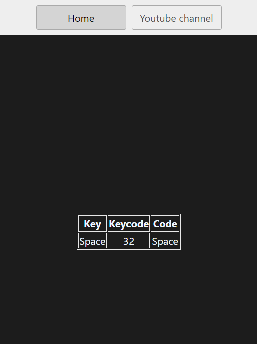

# projects related to DOM

## project link

[click here](https://stackblitz.com/edit/stackblitz-starters-zbfw8x?file=5-keyboard%2Fchaiaurcode.js,index.html)

# solution code

# project 5

```javascript
const insert = document.getElementById("insert");
window.addEventListener("keydown", (e) => {
  insert.innerHTML = `
  <div class='color'>
  
  <table>
  <tr>
    <th>Key</th>
    <th>Keycode</th>
    <th>Code</th>
  </tr>
  <tr>
    <td>${e.key === " " ? "Space" : e.key}</td>
    <td>${e.keyCode}</td>
    <td>${e.code}</td>
  </tr>  
</table>
  </div>
  `;
});
```



# Task Completed✨
