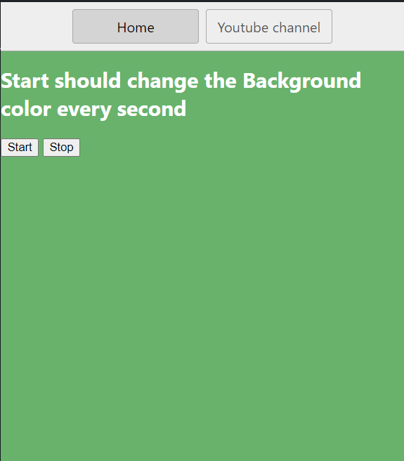

# projects related to DOM

## project link

[click here](https://stackblitz.com/edit/stackblitz-starters-udgqpy?file=index.html)

# solution code

## project 6

```javascript
//generate a random color
const randomColor = function () {
  const hex = "123456789ABCDEF";
  let color = "#";
  for (let i = 0; i < 6; i++) {
    color += hex[Math.floor(Math.random() * 16)];
  }
  return color;
};

//console.log(randomColor());
let intervalId;

const startChanginColor = function () {
  if (!intervalId) {
    intervalId = setInterval(changeBgColor, 1000);
  }
  console.log("for start", intervalId);
  //can write outside
  function changeBgColor() {
    document.body.style.backgroundColor = randomColor();
  }
};

const stopChanginColor = function () {
  clearInterval(intervalId);
  intervalId = null; //good practice
  console.log("for stop", intervalId);
};

document.querySelector("#start").addEventListener("click", startChanginColor);

document.querySelector("#stop").addEventListener("click", stopChanginColor);
```

# Task Completed✨


